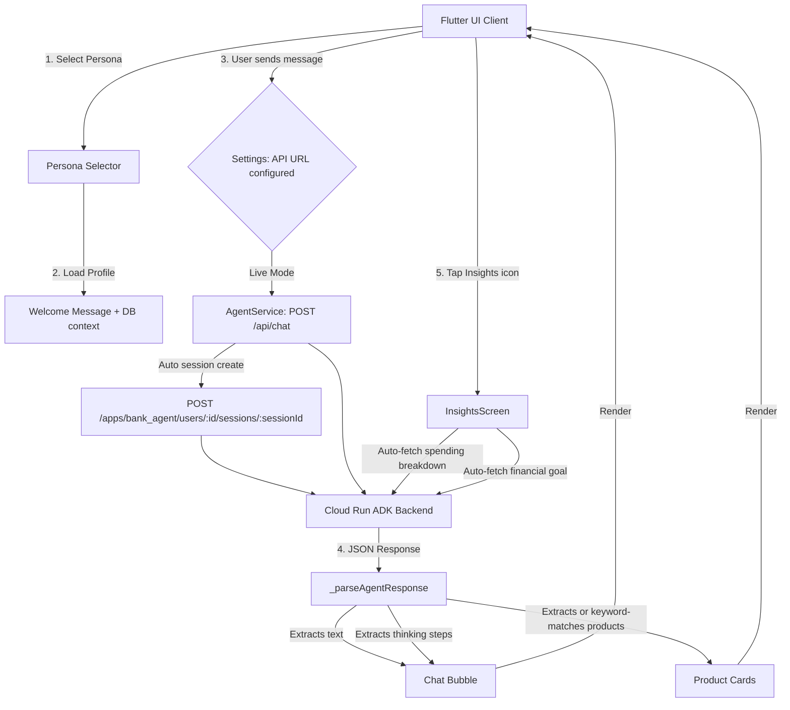

# 🟢 Lloyds Banking Group Agent UI - Hackathon Demo Guide

This guide details the design decisions, system architecture, and demo guidelines for the Lloyds themed Flutter application. It serves as a companion for running a high-fidelity demonstration of your Cloud Run agent service.

## Main chat interface:


## Insights page:


## Goals page:

## 

## 🎨 Lloyds Brand Identity & UX Principles

To make a striking impression, the application incorporates **Lloyds Banking Group (LBG)** visual assets and follows modern fintech UX standards:

- **Primary Green (`#006A4E`) & Deep Green (`#002C1B`)**: Used on headers, buttons, and user text bubbles to project trust and brand familiarity.
- **Accent Gold (`#B59049`)**: Reserved for premium product tags, status indicators, and icon accents to create contrast.
- **Google Font 'Outfit'**: Configured in `main.dart` to deliver clean, modern typography.
- **Personas as retrieved data**: A horizontal scrollable persona selector allows immediate profile switching, mimicking the agent pulling profile details from customer databases.

---

## 🛠️ Architecture Diagram

This diagram shows how the Flutter application coordinates with your deployed Cloud Run endpoint (ADK backend):



---

## 💡 UX Best Practices for Agent Interactions

We have implemented four core UX pillars to address the unique challenges of interacting with AI agents in banking:

### 1. The Thinking Preview Accordion

AI agents often query databases, run eligibility rules, or calculate loan rates, which takes time. A standard loader creates friction.

- **Implementation**: A custom expandable stepper shows the exact logical path the agent is taking (e.g. `🔐 Initiating secure channel (OAuth2)...`, `🧠 Invoking Lloyds Advisor Agent Chain (ADK)...`).
- **Progressive Steps**: In Live Mode, steps stream progressively (adding a line every 600ms) to simulate real-time processing while waiting for the API response.

### 2. Structured Product Cards

Instead of dumping text summaries of Lloyds products, the app extracts matches and lists them as interactive cards.

- **Visual Highlights**: Bold benefit badges (e.g., `5.25% AER interest`), quick bullet points, and an "Apply / Learn More Online" button that opens a detailed product modal.
- **17 Products in Catalog**: Covers Current Accounts, Savings Accounts, ISAs, Mortgages, Credit Cards, and Personal Loans.

### 3. Contextual Suggestion Chips

To prevent "blank canvas syndrome" where the user doesn't know what to type, each profile populates tailored quick-action questions specific to that persona's ID and financial situation.

### 4. Insights Dashboard

A dedicated **Spending & Goals** screen (tap the 📊 icon in the app bar) that auto-fetches:

- A **Spending Breakdown** by category, parsed from live API responses.
- A **Financial Goal** progress tracker tailored to the active persona.

---

## 👥 Demo Personas & Simulated Customer Journeys

Use these five built-in profiles (with real CRM-style IDs) to demonstrate the personalization capabilities of your Cloud Run agent service:

| Persona              | Customer ID | Segment                 | Financial Goal                                        | Suggested Chips                                                         |
| :------------------- | :---------- | :---------------------- | :---------------------------------------------------- | :---------------------------------------------------------------------- |
| **Alice Thornton**   | C001        | Savings Accumulator     | Explore mortgage options and optimize savings growth. | Verify as C001, Show spending insights, Mortgage options for Alice      |
| **Bob Hargreaves**   | C002        | Tax-Efficient Investor  | Optimize cash savings for tax efficiency.             | Verify as C002, Review my Cash ISA, Tax-efficient savings options       |
| **Clara Nguyen**     | C003        | Regular Savings Builder | Establish emergency reserves and high-yield savings.  | Verify as C003, Regular monthly savers, Emergency fund advice           |
| **David Okonkwo**    | C004        | Active Mortgage Holder  | Manage mortgage refinancing and loan consolidation.   | Verify as C004, Refinance my £185k mortgage, Lloyds personal loan rates |
| **Evelyn Marchetti** | C005        | Young Wealth Builder    | Grow liquid capital, open ISAs, explore stock market. | Verify as C005, Optimize my £16k savings, Stocks & Shares ISA details   |

> **Note**: Persona IDs (C001–C005) are used directly as `user_id` in every API request. The ADK backend is expected to look these up in its database.

---

## ⚡ Cloud Run Integration Guide

### Setup

In the **Settings** screen (⚙️ icon in the app bar), configure:

- **Cloud Run Service Endpoint URL**: Your deployed ADK backend base URL (e.g. `https://agent-service-xxxx-uc.a.run.app`). The app auto-appends `/api/chat` if not already present.
- **API Key / Bearer Token** (optional): Added as both `Authorization: Bearer <token>` and `x-api-key` headers.

A **Test Connection** button sends a dummy POST to validate the endpoint is reachable before starting a real session.

### API Contract (Request Payload)

When the app sends a message, it performs **two sequential requests**:

**Step 1 – Auto Session Creation** (prevents "Session not found" errors on ADK):

```
POST {baseUrl}/apps/bank_agent/users/{user_id}/sessions/{sessionId}
```

**Step 2 – Chat Request**:

```
POST {baseUrl}/api/chat
Content-Type: application/json
Authorization: Bearer <token>   (if configured)

{
  "user_id": "C001",
  "session_id": "session_C001_1234567890",
  "message": "User's query string"
}
```

> **Important**: The API contract uses `user_id`, `session_id`, and `message`. There is no `persona` object or `history` array in the request body — session history is managed server-side by the ADK backend.

### Supported API Response Formats

The parser in `agent_service.dart` is versatile and will auto-map fields from your backend:

1. **Response Text**: Scans for keys `response`, `text`, `message`, or `content`.
2. **Thinking steps**: Scans for array keys `thinking`, `reasoning`, or `steps`. If absent, injects generic connection logs.
3. **Structured Products**: Scans for a list under `products`, `recommended_products`, `recommendations`, or `product_recommendations`. If absent, **the UI automatically parses keywords** from the response text (like `"Cash ISA"`, `"Fixed Rate Mortgage"`, `"Personal Loan"`) and links the corresponding product cards dynamically.

---

## 🗂️ Project Structure

```
edb_hackathon_ui/lib/
├── main.dart                  # App entry point, Lloyds theme tokens
├── models/
│   ├── chat_message.dart      # ChatMessage model (text, thinkingSteps, recommendedProducts)
│   ├── persona.dart           # 5 Persona profiles (C001–C005)
│   └── lloyds_product.dart    # LloydsProduct model + fromJson
├── screens/
│   ├── chat_screen.dart       # Main chat UI, persona switching, live agent calls
│   ├── insights_screen.dart   # Spending & Goals dashboard (2-tab layout)
│   └── settings_screen.dart   # API URL + Key configuration & connection tester
├── services/
│   └── agent_service.dart     # HTTP client, session management, response parser, 17-product catalog
└── widgets/
    ├── chat_bubble.dart       # Message rendering, markdown, thinking accordion
    ├── persona_selector.dart  # Horizontal scrollable persona switcher
    └── product_card.dart      # Interactive product recommendation cards
```

---

## 📦 Key Dependencies

| Package            | Version  | Purpose                                   |
| :----------------- | :------- | :---------------------------------------- |
| `http`             | ^1.6.0   | HTTP client for Cloud Run API calls       |
| `google_fonts`     | ^8.1.0   | Outfit font for premium typography        |
| `flutter_markdown` | ^0.7.7+1 | Renders agent markdown responses          |
| `intl`             | ^0.20.3  | Date/number formatting in Insights screen |
