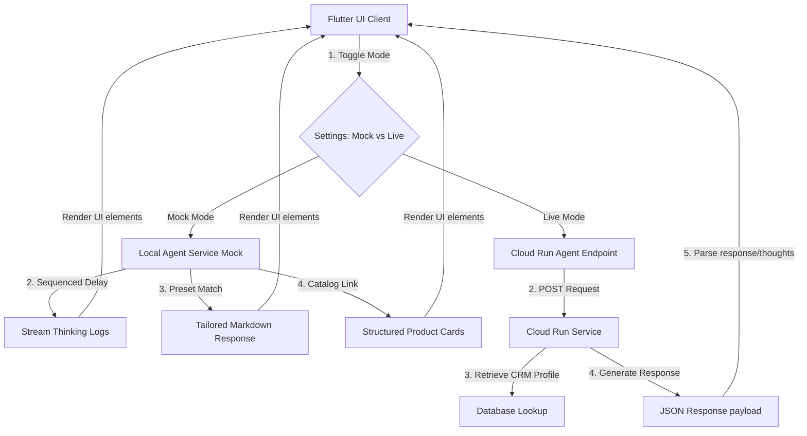

# 🟢 Lloyds Banking Group Agent UI - Hackathon Demo Guide

This guide details the design decisions, system architecture, and demo guidelines for the Lloyds themed Flutter application. It serves as a companion for running a high-fidelity demonstration of your Cloud Run agent service.

## Main chat interface:


## Insights page:


## Goals page:

---

## 🎨 Lloyds Brand Identity & UX Principles

To make a striking impression, the application incorporates **Lloyds Banking Group (LBG)** visual assets and follows modern fintech UX standards:

- **Primary Green (`#006A4E`) & Deep Green (`#002C1B`)**: Used on headers, buttons, and user text bubbles to project trust and brand familiarity.
- **Accent Gold (`#B59049`)**: Reserved for premium product tags, status indicators, and warning logs to create contrast.
- **Google Font 'Outfit'**: Configured in [main.dart](file:///Users/sahilahmed/IdeaProjects/forks/EDB-Hackathon-UI/edb_hackathon_ui/lib/main.dart) to deliver clean, modern typography.
- **Personas as retrieved data**: The horizontal scrollbar allows immediate profile switching, mimicking the agent pulling profile details from customer databases.

---

## 🛠️ Architecture Diagram

This diagram shows how the Flutter application coordinates between the presenter, the local fallback engine, and your deployed Cloud Run endpoint:



---

## 💡 UX Best Practices for Agent Interactions

We have implemented three core UX pillars to address the unique challenges of interacting with AI agents in banking:

### 1. The Thinking Preview Accordion

AI agents often query databases, run eligibility rules, or calculate loan rates, which takes time. A standard loader creates friction.

- **Implementation**: A custom expandable stepper shows the exact logical path the agent is taking (e.g. `[DB] Retrieving user profile...`, `[Rules Engine] Evaluating LISA eligibility...`).
- **Demo Impact**: Builds transparency and user trust. In Mock Mode, these steps stream progressively (adding a line every 600ms) to simulate real-time processing.

### 2. Structured Product Cards

Instead of dumping text summaries of Lloyds products, the app extracts matches and lists them as interactive cards.

- **Visual Highlights**: Bold benefit badges (e.g., `5.25% AER interest`), quick bullet points, and an action button to "Explore Product" which opens a detailed modal.

### 3. Contextual Suggestion Chips

To prevent "blank canvas syndrome" where the user doesn't know what to type, each profile populates tailored quick-action questions.

---

## 👥 Demo Personas & Simulated Customer Journeys

Use these four built-in profiles to demonstrate the personalization capabilities of your Cloud Run agent service:

| Persona            | Segment                  | Financial Goal                                      | Recommended Products                                                  |
| :----------------- | :----------------------- | :-------------------------------------------------- | :-------------------------------------------------------------------- |
| **Sarah Jenkins**  | First-Time Buyer         | Save deposit for a flat in 2 years.                 | Lloyds Lifetime ISA (LISA), Club Lloyds Advantage Saver, FTB Mortgage |
| **David Ross**     | Private Client (Retiree) | Place idle current account savings tax-efficiently. | Lloyds Cash ISA, Lloyds Smart Investor, Club Lloyds Advantage Saver   |
| **Marcus & Chloe** | Joint Account (Family)   | Refurbish loft & save for children's college.       | Lloyds Personal Loan, Lloyds Junior Cash ISA                          |
| **Emily Chen**     | Student (International)  | Start building UK credit, save for summer travels.  | Club Lloyds Advantage Saver, Club Lloyds Current Account              |

---

## ⚡ Cloud Run Integration Guide

### API Contract (Request Payload)

When **Mock Mode is disabled** in settings, the application performs a `POST` request to your configured Cloud Run URL. It sends the following body format:

```json
{
  "message": "User's query string",
  "persona": {
    "id": "sarah",
    "name": "Sarah Jenkins",
    "role": "First-Time Buyer",
    "age": 26,
    "income": "£32,000 / yr",
    "savings": "£6,200"
  },
  "history": [
    {
      "role": "user",
      "content": "Hi, I want to start saving for a deposit."
    },
    {
      "role": "model",
      "content": "Hello Sarah, I recommend starting with a Lifetime ISA..."
    }
  ]
}
```

### Supported API Response Formats

The parser in [agent_service.dart](file:///Users/sahilahmed/IdeaProjects/forks/EDB-Hackathon-UI/edb_hackathon_ui/lib/services/agent_service.dart) is highly versatile and will auto-map fields from your backend:

1.  **Response Text**: Scans for keys `response`, `text`, `message`, or `content`.
2.  **Thinking steps**: Scans for array keys `thinking`, `reasoning`, or `steps`. If absent, it injects placeholder connection logs.
3.  **Structured Products**: Scans for a list of products under `products`. If your agent simply returns plain text, **the UI automatically parses keywords** (like "LISA", "Junior ISA", "Loan") and links the corresponding high-fidelity product cards dynamically!
